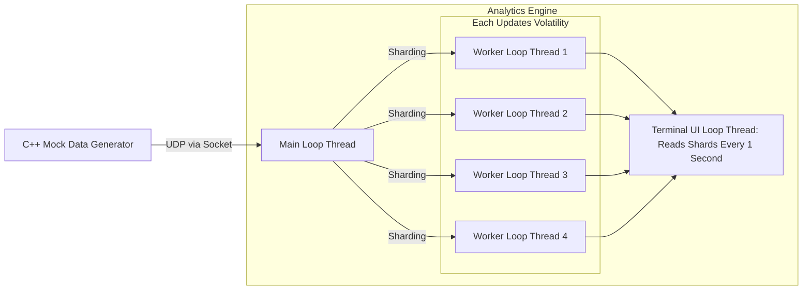

# Real-Time Multi-Threaded C++ Volatility Analytics Engine

A multi-threaded system for calculating real-time volatility of assets across parallel, sharded streams.

## Design

## Performance

Measurements taken on an Apple silicon with macOS.

| Measured Segment | Throughput (Max) | Latency per Update (Min) |
| :--- | :--- | :--- |
| Main Ingestor Loop | 191,799 updates/sec | 5,257.34 ns |
| Workers' Loops | 177,227 updates/sec | 5,831.2 ns |

## Features
- **UDP Ingestion:** Handles market data updates via sockets.
- **Parallel Processing:** Assets are sharded across worker threads to update multiple assets at the same time.
- **Thread-Safe Efficient Concurrency:** Uses a `std::swap` double-buffering technique with `std::mutex` and `std::condition_variable` to ensure thread safety when channeling data between main and worker threads without creating performance bottlenecks.
- **Graceful Shutdown:** uses `std::mutex` and `std::condition_variable` to allow every worker thread to exit properly while minimising data loss during termination.
- **Welford's Algorithm:** O(1) online calculation of volatility i.e. sample standard deviation for log-returns.

