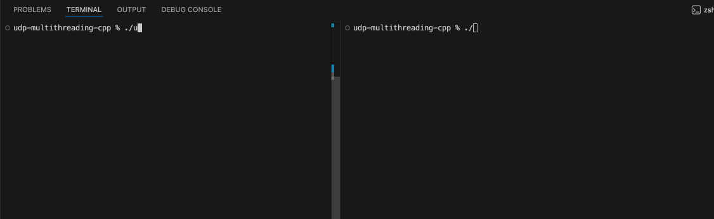
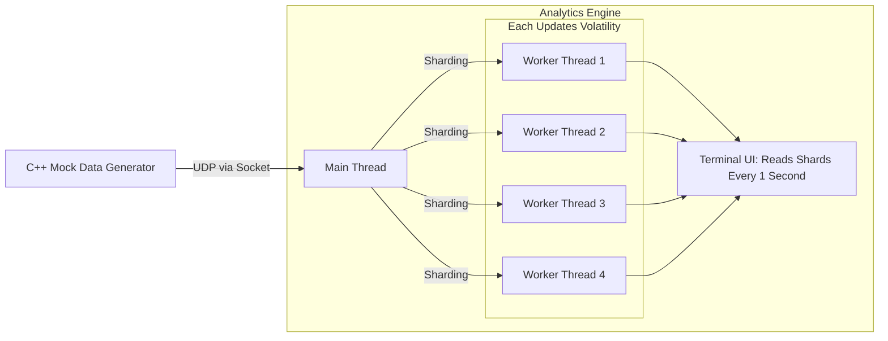

# Real-Time Multi-Threaded C++ Volatility Analytics Engine

A multi-threaded system for calculating real-time volatility across parallel, sharded asset streams.

## Design

## Performance
Based on the main ingestor loop of the analytics engine. 

- Average **latency** per update: 5257.34ns
- **Throughtput**, updates per second: 191799/s

## Features
- **UDP Ingestion:** Handles market data updates via sockets.
- **Parallel Processing:** Assets are sharded across worker threads.
- **Efficient Concurrency:** Uses a `std::swap` double-buffering technique to minimise time spent holding mutex locks.
- **Welford's Algorithm:** O(1) online calculation of volatility i.e. sample standard deviation for log-returns.

